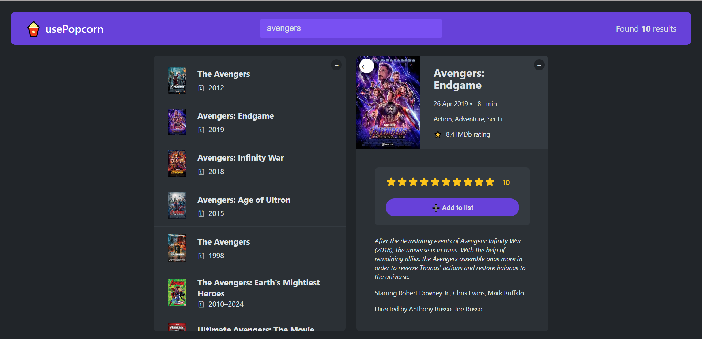
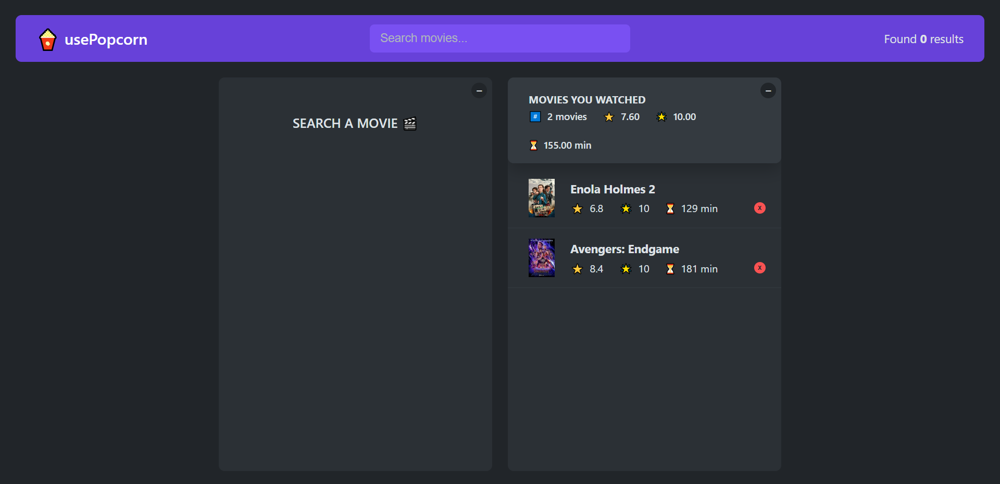

# 🍿 usepopcorn

A simple React app to search for movies, save them to a "watched" list, and rate them – built with React Hooks and clean component design.

## 📸 Demo

https://usepopcorn-self-tau.vercel.app/

## ⚡ Features

- ✅ Search movies using the OMDb API
- ✅ View detailed movie info
- ✅ Add movies to a "Watched" list
- ✅ Rate and review movies
- ✅ Persistent state with localStorage

## 🚀 Technologies Used

- React
- React Hooks (useState, useEffect, useReducer, useRef)
- OMDb API
- CSS
- localStorage

## ⚙️ Usage

- Type in a movie title in the search bar.

- Click a result to view details.

- Add it to your watched list and rate it.

- Your watched list is saved in localStorage!

## 🎨 Screenshots

